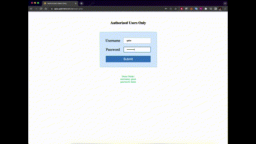
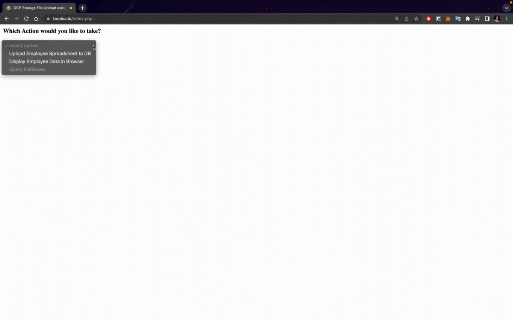

# Excel to MySQL Web Application

Excel to CSV File Converter, MySQL Database Uploader and Viewer, and automated Email Scheduler

**This project is in on-going development, but as a security precaution, most updates are no longer being pushed to this repository (January 2023)**

See the working application at [app.gabrielscott.io](https://app.gabrielscott.io)

## Summary

Upload spreadsheet of employee records to a MySQL database running on a GCP Server, view original file and database employee data in the web browser, and automate the scheduling of outgoing notification emails to the employees' boss for a reminder to send a gift

## Complete List of Tasks Performed

- Dynamically offers drop down menu options to the user based on choice of uploading new data, or displaying existing data from the database in the browser
- Uploads an excel file (.xlsx) to a Google Cloud Storage Bucket using Google Storage API calls, PHP, and ajax POST/GET requests, then appends current date to uploaded file name for long-term storage and organization of previous employee files
- Sends POST request to Apache2 web server containing action to perform, using API key authorization
- Displays uploaded file in it's original state in the browser using PhpSpreadsheet open-source software
- Converts Excel file to .csv file according to specific formatting requirements
- Parses, formats, and imports data from the .csv file into hosted MySQL database
  - Authenticates user from locally saved credentials and grants permission to access and alter the MySQL database
- POST request response contains file upload metadata, various success/fail messages, the individual SQL queries executed and their success/failure statuses, and new file locations
- One time per day, the VM runs the script [bday_emailer.php](emailer_script/bday_emailer.php) via cron job and checks the mysql database for upcoming employee birthdays (employees who have been employed at least 6 months), automates sending of email to the boss with a reminder to send a birthday gift
  - Script creates and prints to local log file for record of email sent, and/or result of queries run
- Updates database of employees when new files are uploaded (roughly once per month); specifically when employee records change
  - Prior to upload of up-to-date employee spreadsheet, a query is run to mark all employees in the MySQL database as "inactive" employees
  - Then the database records are updated and marked with "active=TRUE" once again as each entry in the spreadsheet is inserted or re-inserted into the MySQL database. This is accomplished with a REPLACE statement like the following:

  ```SQL
  REPLACE INTO employees (first_name, last_name, start_date, date_of_birth, address, email, phone_number, schedule, position, active) VALUES (?,?,?,?,?,?,?,?,?,TRUE);
  ```

More examples of MySQL statements can be viewed in [sql_statements.md](sql_statements.md)

## Demo

- [Working Demonstration](https://app.gabrielscott.io)
  - dummy data used to protect the information of real people in the database

### Uploading an Excel File to the Database

Note: The database records are censored to protect the privacy of real people



### Displaying Employee Records

**Display All Employees:**


**Display Active/Inactive Employees:**


**Display Employees with Upcoming Birthdays:**



## Future Functionality (Tasks still in progress)

- Specific options avilable in the user interface to query the database

## Objectives of Project (Note from Developer)

I have been learning PHP on the fly on this project, having never worked with it before. I have also been brushing-up on my server-client programming and setting up webserver type applications and static web-page concepts, as well as learning more about the Ajax, PHP, JavaScript, and HTTP technology stack. Additionally, I have been working at cementing my knowledge of cloud computing concepts, with Apache web server and Google Cloud Platform. So far, it has been a very fruitful project

**Notes:**

- File Upload script requires `/var/www/domain.com/vendor/` (created with Composer for php)
- Apache2 php.ini file is located at `/etc/php/8.1/apache2/php.ini`
  - This is separate from ubuntu php.ini file which is located at `/etc/php/8.1/cli/php.ini`
    - conf.d file is located at `/etc/php/8.1/cli/conf.d`
  - Enabled extension=myslqi here by uncommenting line after searching in vim with `ls ./ | grep php`
- Working with GCP from command line is made very easy in VSCode bash terminal with the GCP extension. Makes it easy to SCP files in to the VM
- The files in this repository are not *currently* organized according in the same structure as they are on the GCP server, and thus **one cannot simply clone this repository and expect it to work correctly**
  - Throughout my server-side development process, I have been peforming an SCP every time I wanted to push changes to the server rather than just pushing/pulling from my git repo
- To set up the correct directory organization perform the following steps
  - For the sake of simplicity, I'm going to work with the assumption that you already have a working Apache2 webserver running on a GCP Compute Engine virtual machine - *clearly a big assumption*

## Setting up and configuring Composer for PHP

1. I initially set up Composer at the project level on apache at ```/var/www/domain.com/composer```
2. Next I configured the ```composer.json``` file to add project dependencies
3. Then I ran ```php composer.phar update```
4. I added require statments for ```google/cloud-storage``` and ```phpoffice/phpspreadsheet``` and version numbers
5. I moved ```vendor/``` to lowest level of apache, just below public html files folder

### Important Composer Commands

- ```php composer.phar update```

### Important PHP Usage

- See where all php.ini configuration files are ```php --ini```
- Create info.php file and host it on apache web server. This file has a lot of useful configuration information when viewed in web browser and looks exactly like this:

  ```php
  <?php
    // info.php
    echo("Current user is: "); // optional - get apache2 web server user
    echo exec('whoami');
    phpinfo(); 
    ?>
  ```

- Get current user: Add ```echo exec('whoami');``` to above ```info.php``` file

## TODO

- [ ] Style charts and rest of page
- [x] Rename repository
- [ ] Calendar visual aide with birthdays on it could be nice - show 2 months (this,next)
- [x] Figure out which open-source license to add to this project before making repository public
- [x] Change permissions on Google Cloud Storage bucket
- [x] Add click to download as CSV. For original file, or DB query selection, or both
- [x] See about obscuring certain php files
- [x] Tighten up user authentification all over, and secure site against potential SQL injection attacks
- [x] Adjust and secure the user authorization to upload to, access Google Cloud Storage bucket
- [x] Change mysql db user info for user www-data
- [x] Delete files created during the upload process (.csv, .html, etc)
- [x] Create demonstration web app with same functionality minus ability to update DB or view sensitive data
- [x] Clean up GCP folders and remove old file versions
- [x] Add authorization
- [x] Add phone number formatting (dashes) for other display options other than display all
- [x] Create screen recording gif of web application in action (don't use sensitive data)
- [x] color code by position
- [x] In "dislay all employees" use background color of red for inactive employees
- [x] Add check in [bday_emailer.php](emailer_script/bday_emailer.php) script to only notify about employees who have been at the company for at least 6 months
- [x] Change primary key from email to combination of first and last names
- [x] In dislay all employees sort by active, then last name
- [x] Style app main webpage
- [x] Hide MySQL DB credentials
  - [x] *Encrypt credentials on GCP VM ?*
  - [x] Double check that this is not accessible from outside
- [x] Add date to uploaded xlsx files for storage
- [x] Add ability to print data from MySQL database
- [x] Successfully handle connecting to MySQL DB
- [x] Handle conversion from xlsx to csv
- [x] Make sure birthdays displayed are active employees
- [x] Trim .csv entries before adding to mysql query strings
  - [x] Trim leading/trailing asterisks
  - [x] Trim leading/trailing whitespace and whitespace-like special characters
  - [x] remove extra whitespace-like special characters
- [x] Return csv file path in json from POST request return
- [x] Store password for mysqli to grab for db outside public folders. in ```secret/```
- [x] Add ```composer.lock``` to git repository
- [x] Add more of my saved resources to Resources section below in README

## Resources

See page [resources.md](resources.md) to view a list of many (but not all) of the specific resources that I referenced

Copyright 2022 - Gabe Scott
