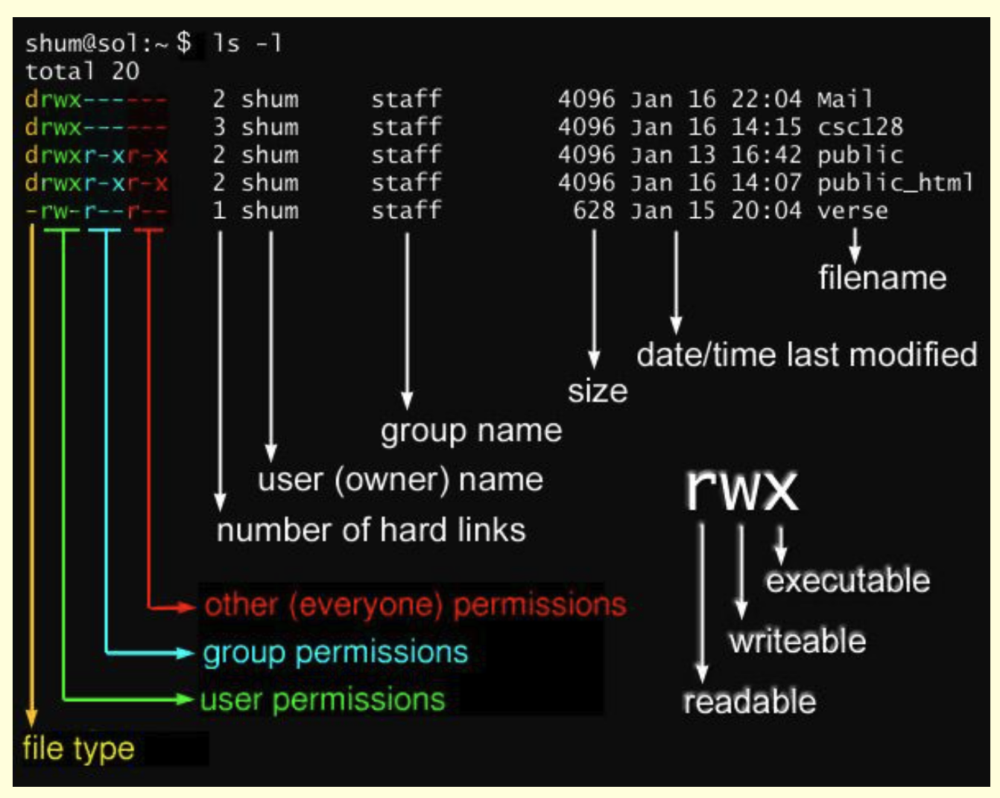

# Resources

- File Permissions explanation graph
  - 

- [Include the html from an html file in a div](https://www.w3schools.com/howto/howto_html_include.asp)
- [Changing file permissions w/ chmod - Stack Overflow](https://stackoverflow.com/questions/28886936/chmod-protect-users-file-being-accessed-so-only-owner-can-access)
- [man page for git checkout](https://man7.org/linux/man-pages/man1/git-checkout.1.html)
- [man page for git switch](https://man7.org/linux/man-pages/man1/git-switch.1.html)
- [Push new branch to new remote repository branch and set upstream](https://stackoverflow.com/questions/2765421/how-do-i-push-a-new-local-branch-to-a-remote-git-repository-and-track-it-too)
- [Move untracked changes to new git branch](https://www.baeldung.com/git-move-uncommitted-work-to-new-branch#:~:text=Using%20the%20git%20checkout%20Command,changes%20to%20the%20new%20branch.)
- [Display phpspreadsheet in html - Stack Overflow](https://stackoverflow.com/questions/68211913/phpspreadsheet-select-specific-sheet-to-display-in-html)
- [dauxio/daux.io repository - Pretty markdown documentation generator](https://github.com/dauxio/daux.io)
- [mysqli bind-param() PHP](https://www.php.net/manual/en/mysqli-stmt.bind-param.php)
- [Trim whitespace phpspreadsheet](https://stackoverflow.com/questions/24874195/phpexcel-whitespaces-not-removed-from-individual-cells)
- [Looping through cells - phpspreadsheet](https://phpspreadsheet.readthedocs.io/en/latest/topics/accessing-cells/#looping-through-cells)
- [Retreive cell data by column and row - PhpSpreadsheet API](https://phpspreadsheet.readthedocs.io/en/latest/topics/accessing-cells/#retrieving-a-cell-value-by-column-and-row)
- [Remove excess whitespace inside PHP string - Stack Overflow](https://stackoverflow.com/questions/1703320/remove-excess-whitespace-from-within-a-string)
- [Installing and setting up PHP on Ubuntu - ServerLab](https://www.serverlab.ca/tutorials/linux/web-servers-linux/installing-php-for-apache-on-ubuntu/)
- [Composer Documentation](https://getcomposer.org/doc/01-basic-usage.md)
- [PHP for uploading to GCS - Zatackcoder (blog)](https://zatackcoder.com/upload-file-to-google-cloud-storage-using-php/)
- [PhpSpreadsheet - open source tool](https://phpspreadsheet.readthedocs.io/en/latest/topics/reading-and-writing-to-file/)
- [PhpSpreadsheet - GitHub Repository](https://github.com/PHPOffice/PhpSpreadsheet)
- [Convert xlsx to csv file - Stack Overflow](https://stackoverflow.com/questions/6895665/convert-xlsx-file-to-csv-file-using-php)
- [Download Storage object php - GCP Documentation](https://cloud.google.com/storage/docs/downloading-objects#storage-download-object-php)
- [Cloud Storage Reference - GCP Documentation](https://cloud.google.com/storage/docs/reference/libraries)
- [Google Cloud API - Storage Client](https://googleapis.github.io/google-cloud-php/#/docs/google-cloud/v0.122.0/storage/storageclient)
- [JQuery API - data](https://api.jquery.com/data/)
- [Set Apache File Permissions (owner)](https://askubuntu.com/questions/1334375/how-to-set-both-www-data-and-me-as-owner)
- [Grant user file permissions (groups)](https://askubuntu.com/questions/365087/grant-a-user-permissions-on-www-data-owned-var-www)
- [Import CSV into MySQL](https://www.phpflow.com/php/import-csv-file-into-mysql/)
- [MySQLi PHP Database extension](https://www.php.net/manual/en/book.mysqli.php)
- [PHP mysqli class](https://www.php.net/manual/en/class.mysqli)
- [mysqli documentation](https://www.php.net/manual/en/class.mysqli.php)
- [MySQL Documentation](https://dev.mysql.com/doc/refman/8.0/en/)
- [Grant User Permissions in MySQL](https://phoenixnap.com/kb/how-to-create-new-mysql-user-account-grant-privileges)
- [Import csv into MySQL DB](https://www.phpflow.com/php/import-csv-file-into-mysql/)
- [Set all values in a table to specific value - mysql](https://stackoverflow.com/questions/13612104/how-to-set-all-values-in-a-single-column-mysql-query)
- [Convert str to Date/DateTime - PHP](https://www.geeksforgeeks.org/php-converting-string-to-date-and-datetime/)
- [Retreive cell data - PhpSpreadsheet (Stack Overflow)](https://stackoverflow.com/questions/44304795/how-to-retrieve-date-from-table-cell-using-phpspreadsheet)
- [date() man page - PHP](https://www.php.net/manual/en/function.date.php)
- [NumberFormat PhpSpreadsheet](https://github.com/PHPOffice/PhpSpreadsheet/blob/master/src/PhpSpreadsheet/Style/NumberFormat.php)
- [PhpSpreadsheet Recipes](https://phpspreadsheet.readthedocs.io/en/latest/topics/recipes/)
- [MySQL Update](https://www.mysqltutorial.org/mysql-update-data.aspx)
- [fgetcsv() man page - PHP](https://www.php.net/manual/en/function.fgetcsv.php)
- [mysqli_real_query() - W3Schools](https://www.w3schools.com/php/func_mysqli_real_query.asp)
- [Replace Command - MySQL](https://dev.mysql.com/doc/refman/8.0/en/replace.html)
- [Insert Date Object in MySQL](https://www.ntchosting.com/encyclopedia/databases/mysql/insert-date/#:~:text=The%20default%20way%20to%20store,the%20dates%20as%20you%20expect.)
- [Data Types - MySQL Docs](https://dev.mysql.com/doc/refman/8.0/en/data-types.html)
- [Database Privileges MySQL](https://askubuntu.com/questions/1029177/error-1698-28000-access-denied-for-user-rootlocalhost-at-ubuntu-18-04)
- [Escaping from HTML - PHP](https://www.php.net/manual/en/language.basic-syntax.phpmode.php)
- [$_SERVER array - PHP](https://www.php.net/manual/en/reserved.variables.server.php)
- [Import CSV to MySQL using PHP file read](https://phppot.com/php/import-csv-file-into-mysql-using-php/)
- [mysqli->query() man page](https://www.php.net/manual/en/mysqli.query.php)
- **[Append text into html by id - PHP](https://stackoverflow.com/questions/35886770/php-append-text-into-html-element-with-certain-id)**
