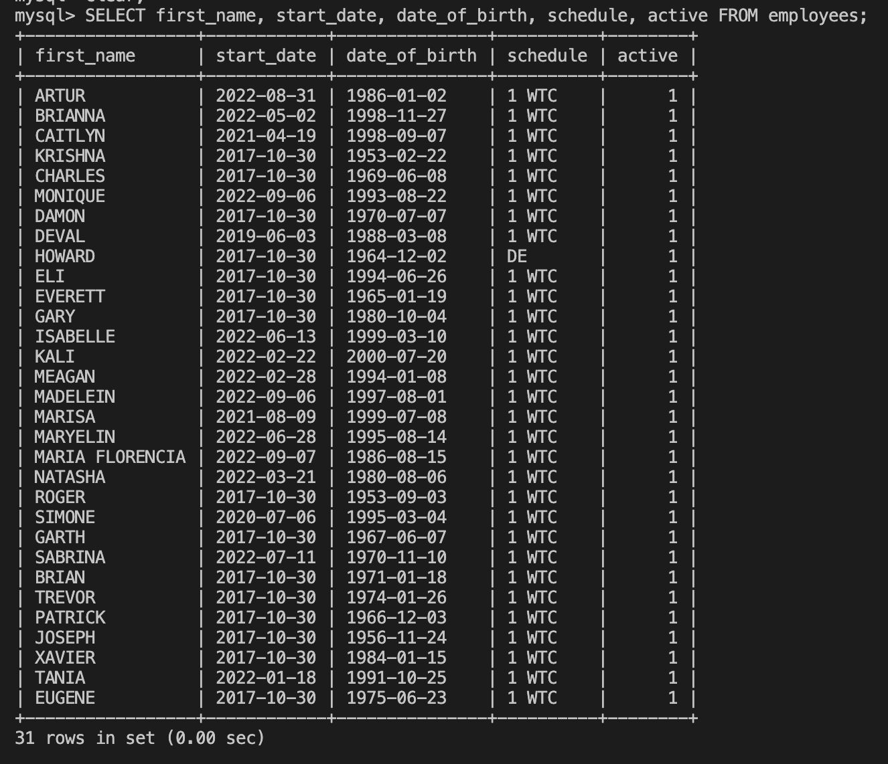

# Screenshots

## MySQL Queries

**Query:**

```sql
DESCRIBE employees;
 ```

----------


**Query:**

```sql
SELECT first_name, start_date, date_of_birth, schedule, active FROM employees;
 ```

----------



